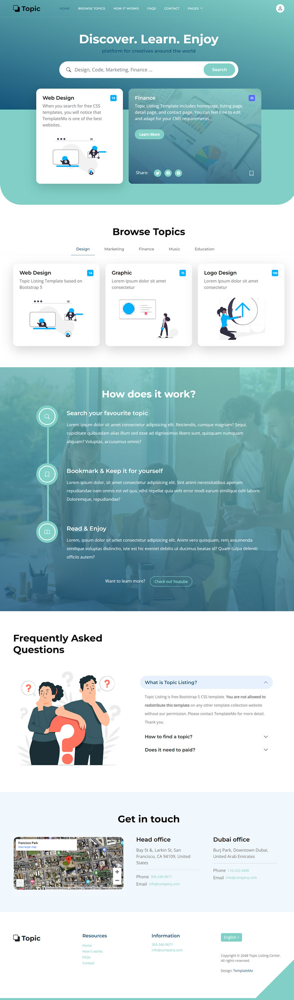

# About us
Unofficial templates collection from TemplateMo.

## Topic Listing Template

[Live View](https://templatemo.com/live/templatemo_590_topic_listing) | 
[Download](https://templatemo.com/download/templatemo_590_topic_listing) | 
[Full-size Screenshot](https://templatemo.com/screenshots/full-template-590-topic-listing.jpg) | 
[HTML Templates](https://www.tooplate.com/free-templates)

Topic Listing includes 4 HTML pages for home, listing, detail and contact. Homepage features many sections such as search bar, content tabs, timeline, accordion, etc. This layout used Teal or DarkCyan color gradients. It is easy to modify with the use of Bootstrap 5 CSS library.

Tags: 
[education](https://templatemo.com/tag/education), 
[bootstrap-5](https://templatemo.com/tag/bootstrap-5), 
[digital-marketing](https://templatemo.com/tag/digital-marketing), 
[green](https://templatemo.com/tag/green), 
[multi-page](https://templatemo.com/tag/multi-page), 
[timeline](https://templatemo.com/tag/timeline)

## Screenshot

## License
MIT License

## About TemplateMo

TemplateMo was founded in year 2008. We provide you 100% free download for HTML CSS website templates, responsive mobile-friendly layouts, which can be applied in your static HTML websites or further modified as dynamic CMS sites. You may download, modify or edit them to complete your website requirements. Latest templates include  [digital marketing](https://templatemo.com/tag/digital-marketing),  [one-page](https://templatemo.com/tag/one-page)  parallax layouts,  [landing pages](https://templatemo.com/tag/landing-page), etc.

Since all templates are  **absolutely free**, there is no restriction about usage rights. However, we are not responsible for anything related to compatibility or accuracy or correctness of HTML CSS codes in any website template for any web browser. You may use them at your own risk. However, please let us know if you see any kind of problem or issue and we will try to fix that.

You can fully customize our templates for your clients and charge them for your service. You can remove any credit link or anything when you do editing in any HTML editor.

Feel free to  [contact](https://templatemo.com/contact)  us if you have anything to say. Thank you.
